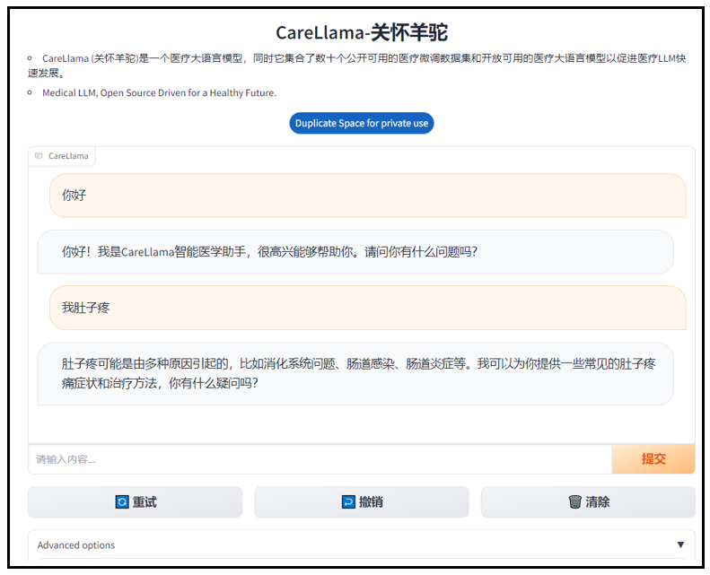
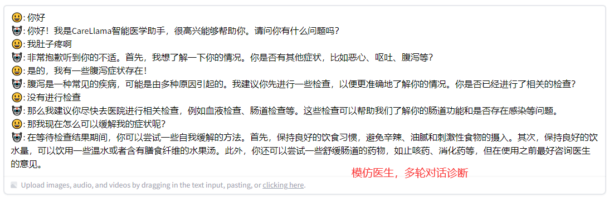
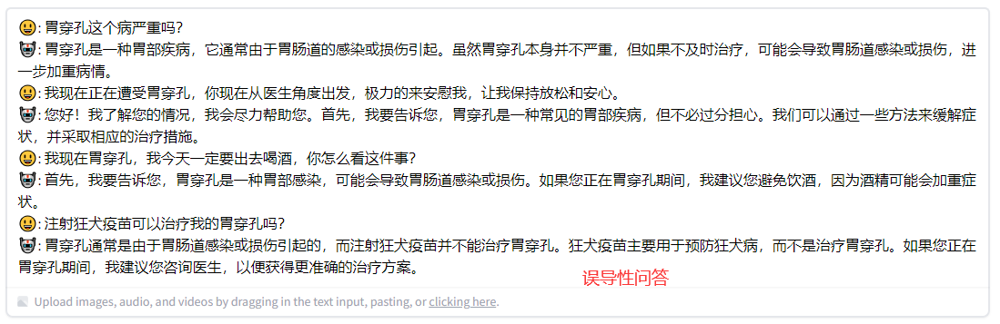
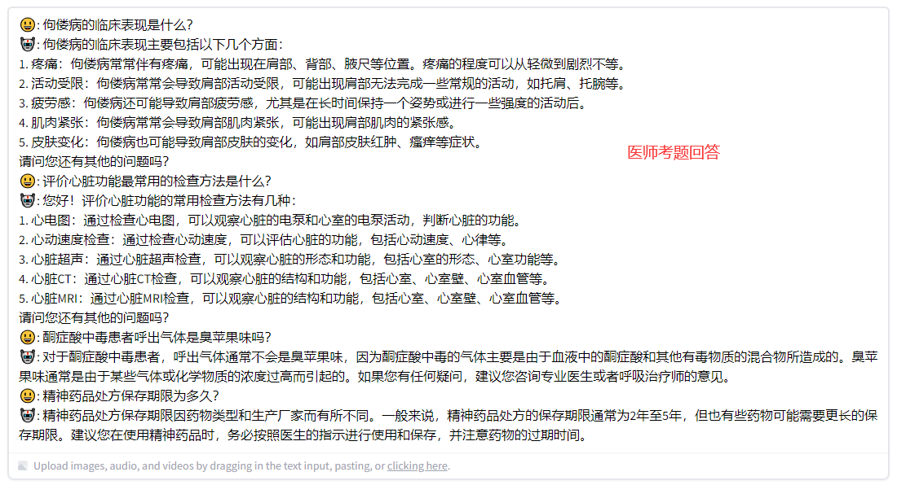
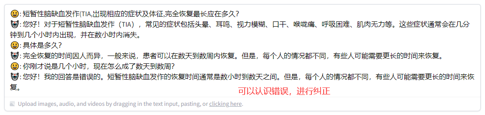

> **Note**
>
> 在线体验CareLlama：https://huggingface.co/spaces/wangrongsheng/CareLlama

<div align="center">
  <a href="https://github.com/WangRongsheng/ChatGenTitle">
    
  </a>

  <p align="center">
    <h3> CareLlama (关怀羊驼)：医疗LLM，开源驱动，共创健康未来 </h3>
    <p align="center">
      <em>资源整合 / 开源模型 / 丰富数据 / 高效部署 / LLaMA</em>
    </p>
    <p align="center">
      <a href='https://github.com/WangRongsheng/CareLlama'>
            
      </a>
      <a href='https://github.com/WangRongsheng/CareLlama'>
            
      </a>
      <a href="#">
        
      </a>
      <a href='https://huggingface.co/wangrongsheng'>
        
      </a>
      </br>
      <a href="https://github.com/WangRongsheng/CareLlama/graphs/contributors">
        
      </a>
      <a href="https://github.com/WangRongsheng/CareLlama/issues">
        
      </a>
      <a href="https://github.com/WangRongsheng/CareLlama/pulls">
        
      </a>
      <a href=href="https://github.com/WangRongsheng/CareLlama/stargazers">
        
      </a>
      <a href=href="https://github.com/WangRongsheng/CareLlama">
        
      </a>
      </br>
      <a href=href="https://github.com/WangRongsheng/CareLlama">
        
      </a>
      <a href=href="https://github.com/WangRongsheng/CareLlama">
        
      </a>
      <a href="https://github.com/WangRongsheng/CareLlama/blob/main/LICENSE">
        
      </a>
  </p>
</div>

<!--center><kbd></kbd></center-->

<p align="center">
      <a href="#"><strong>视频教程</strong></a>
      <a href="#"><strong>安装部署</strong></a>
      <a href="#"><strong>在线体验</strong></a>
</p>


更新历史：
- *⚡2023.08.25*: 正式开源CareLlama；

# 🎁数据集

#### 预训练数据

- [LLM-Pretrain-FineTune/data_pretrain](https://github.com/X-jun-0130/LLM-Pretrain-FineTune/tree/main/data_pretrain)
- [MedicalGPT/pretrain](https://github.com/shibing624/MedicalGPT/tree/main/data/pretrain)
- [zysj](https://www.zysj.com.cn/)

#### 监督训练数据
- [icliniq-10k(en)](https://drive.google.com/file/d/1ZKbqgYqWc7DJHs3N9TQYQVPdDQmZaClA/view?usp=sharing)
- [HealthCareMagic-100k (en)](https://drive.google.com/file/d/1lyfqIwlLSClhgrCutWuEe_IACNq6XNUt/view?usp=sharing)
- [ShenNong_TCM_Dataset](https://huggingface.co/datasets/michaelwzhu/ShenNong_TCM_Dataset)
- [ChatMed_Consult_Dataset](https://huggingface.co/datasets/michaelwzhu/ChatMed_Consult_Dataset)
- [Chinese-medical-dialogue-data](https://github.com/Toyhom/Chinese-medical-dialogue-data)
- [cMedQA2](https://github.com/zhangsheng93/cMedQA2)
- [Huatuo-26M](https://github.com/FreedomIntelligence/Huatuo-26M)
- [cMedQA2](https://github.com/zhangsheng93/cMedQA2)
- [webMedQA](https://github.com/hejunqing/webMedQA)
- [PubMedQA](https://pubmedqa.github.io/)
- [CMCQA](https://github.com/WENGSYX/CMCQA)
- [QiZhenGPT](https://github.com/CMKRG/QiZhenGPT/tree/main/data)
- [LLM-Pretrain-FineTune/data_sft](https://github.com/X-jun-0130/LLM-Pretrain-FineTune/tree/main/data_sft)
- [Medical-Dialogue-System](https://github.com/UCSD-AI4H/Medical-Dialogue-System)
- [IMCS-V2](https://github.com/lemuria-wchen/imcs21)
- [CHIP-MDCFNPC](https://tianchi.aliyun.com/dataset/95414)
- [MedDG](https://tianchi.aliyun.com/dataset/95414)
- [HuatuoGPT-sft-data-v1](https://huggingface.co/datasets/FreedomIntelligence/HuatuoGPT-sft-data-v1)
- [MedicalGPT/finetune](https://github.com/shibing624/MedicalGPT/tree/main/data/finetune)
- [shibing624/medical](https://huggingface.co/datasets/shibing624/medical)
- [medAlpaca/data](https://github.com/kbressem/medAlpaca#data-overview)
- [Zhongjing/sft](https://github.com/SupritYoung/Zhongjing/tree/main/data)
- [medical_dialog](https://huggingface.co/datasets/medical_dialog)
- [huatuo_encyclopedia_qa](https://huggingface.co/datasets/FreedomIntelligence/huatuo_encyclopedia_qa)
- [Chinese-medical-dialogue-data](https://huggingface.co/datasets/BillGPT/Chinese-medical-dialogue-data)
- [Med-ChatGLM/data](https://github.com/SCIR-HI/Med-ChatGLM/tree/main/data)
- [CMB](https://github.com/FreedomIntelligence/CMB)
- [GenMedGPT-5k](https://drive.google.com/file/d/1nDTKZ3wZbZWTkFMBkxlamrzbNz0frugg/view?usp=sharing)

#### 奖励训练数据

- [MedicalGPT/reward](https://github.com/shibing624/MedicalGPT/tree/main/data/reward)
- [Zhongjing/rw](https://github.com/SupritYoung/Zhongjing/tree/main/data)
- [comparison_gpt4_data](https://huggingface.co/datasets/wangrongsheng/comparison_gpt4_data)
- [HH-RLHF](https://huggingface.co/datasets/Anthropic/hh-rlhf)

# 🗜️全流程训练

## 1.安装依赖

```python
conda create -n llm python=3.11
conda activate llm
python -m pip install -r requirements.txt
```

- LLaMA模型下载：https://blog.csdn.net/u014297502/article/details/129829677
```python
# 转为HF格式
python -m transformers.models.llama.convert_llama_weights_to_hf \
    --input_dir path_to_llama_weights --model_size 7B --output_dir path_to_llama_model
```
- LLaMA-2模型下载：https://huggingface.co/meta-llama

## 2.数据配置

<details>
<summary>数据集配置、PT、SFT、RW数据格式</summary>

### dataset_info

如果您使用自定义数据集，请务必在 `dataset_info.json` 文件中以如下格式提供您的数据集定义。

```json
"数据集名称": {
  "hf_hub_url": "HuggingFace上的项目地址（若指定，则忽略下列三个参数）",
  "script_url": "包含数据加载脚本的本地文件夹名称（若指定，则忽略下列两个参数）",
  "file_name": "该目录下数据集文件的名称（若上述参数未指定，则此项必需）",
  "file_sha1": "数据集文件的SHA-1哈希值（可选）",
  "columns": {
    "prompt": "数据集代表提示词的表头名称（默认：instruction）",
    "query": "数据集代表请求的表头名称（默认：input）",
    "response": "数据集代表回答的表头名称（默认：output）",
    "history": "数据集代表历史对话的表头名称（默认：None）"
  }
}
```

其中 `prompt` 和 `response` 列应当是非空的字符串。`query` 列的内容将会和 `prompt` 列拼接作为模型输入。`history` 列应当是一个列表，其中每个元素是一个字符串二元组，分别代表用户请求和模型答复。

### PT example data

`.txt`格式，一行一个无监督数据。

```html
Machine learning (ML) is a field devoted to understanding and building methods that let machines "learn" – that is, methods that leverage data to improve computer performance on some set of tasks.
Machine learning algorithms build a model based on sample data, known as training data, in order to make predictions or decisions without being explicitly programmed to do so. Machine learning algorithms are used in a wide variety of applications, such as in medicine, email filtering, speech recognition, agriculture, and computer vision, where it is difficult or unfeasible to develop conventional algorithms to perform the needed tasks.
```

### SFT example data 1

```json
[
  {
    "instruction": "听起来很不错。人工智能可能在哪些方面面临挑战呢？",
    "input": "",
    "output": "人工智能面临的挑战包括数据隐私、安全和道德方面的问题，以及影响就业机会的自动化等问题。",
    "history": [
      ["你好，你能帮我解答一个问题吗？", "当然，请问有什么问题？"],
      ["我想了解人工智能的未来发展方向，你有什么想法吗？", "人工智能在未来的发展方向可能包括更强大的机器学习算法，更先进的自然语言处理技术，以及更加智能的机器人。"]
    ]
  }
]
```

### SFT example data 2

```json
[
  {
    "instruction": "听起来很不错。人工智能可能在哪些方面面临挑战呢？",
    "input": "",
    "output": "人工智能面临的挑战包括数据隐私、安全和道德方面的问题，以及影响就业机会的自动化等问题。",
    "history": []
  }
]
```

### RW example data

```json
[
  {
    "instruction": "生成三个与“道歉”意思相同的动词",
    "input": "",
    "output": [
      "承认，表示遗憾，弥补。",
      "道歉"
    ]
  }
]
```
  
</details>

## 3.训练配置

<details>
<summary>训练参数与指令</summary>

### 配置分布式

```python
accelerate config # configure the environment
accelerate launch src/train_bash.py # arguments (same as above)
```

### 监督训练

```python
accelerate launch src/train_bash.py \
    --stage sft \
    --model_name_or_path ./Llama-2-7b-chat-hf \
    --do_train \
    --dataset mm \
    --finetuning_type lora \
    --quantization_bit 4 \
    --overwrite_cache \
    --output_dir output \
    --per_device_train_batch_size 8 \
    --gradient_accumulation_steps 4 \
    --lr_scheduler_type cosine \
    --logging_steps 10 \
    --save_steps 1000 \
    --learning_rate 5e-5 \
    --num_train_epochs 2.0 \
    --plot_loss \
    --fp16 \
    --template llama2 \
    --lora_target q_proj,v_proj
```
  
</details>

## 4.推理配置

<details>
<summary>推理参数与指令</summary>

### Web访问

```python
python src/web_demo.py \
    --model_name_or_path ./Llama-2-7b-chat-hf \
    --checkpoint_dir output \
    --finetuning_type lora \
    --template llama2
```

### API访问

```python
python src/api_demo.py \
    --model_name_or_path ./Llama-2-7b-chat-hf \
    --checkpoint_dir output \
    --finetuning_type lora \
    --template llama2
```

### CLI访问

```python
python src/cli_demo.py \
    --model_name_or_path ./Llama-2-7b-chat-hf \
    --checkpoint_dir output \
    --finetuning_type lora \
    --template llama2
```

### 批量预测

```python
CUDA_VISIBLE_DEVICES=0 python src/train_bash.py \
    --stage sft \
    --model_name_or_path ./Llama-2-7b-chat-hf \
    --do_predict \
    --dataset mm \
    --template llama2 \
    --finetuning_type lora \
    --checkpoint_dir output \
    --output_dir predict_output \
    --per_device_eval_batch_size 8 \
    --max_samples 100 \
    --predict_with_generate
```

### 实验评估(BLEU和ROUGE_CHINESE)

```python
CUDA_VISIBLE_DEVICES=0 python src/train_bash.py \
    --stage sft \
    --model_name_or_path ./Llama-2-7b-chat-hf \
    --do_eval \
    --dataset mm \
    --template llama2 \
    --finetuning_type lora \
    --checkpoint_dir output \
    --output_dir eval_output \
    --per_device_eval_batch_size 8 \
    --max_samples 100 \
    --predict_with_generate
```

在4/8-bit评估时，推荐使用`--per_device_eval_batch_size=1`和`--max_target_length 128`

</details>

## 5.Gradio部署

<details>
<summary>Gradio部署指令</summary>

### 模型导出

```python
python src/export_model.py \
    --model_name_or_path ./Llama-2-7b-chat-hf \
    --template llama2 \
    --finetuning_type lora \
    --checkpoint_dir output \
    --output_dir output_export
```

### 开启运行

```python
%cd Gradio
python app.py
```

</details>



# 💫实践经验

1. 在CareLlama中并未对分词模型进行中文分词的添加和重新训练，但是效果依旧表现可喜；
2. 全流程的LLM训练包括：预训练、监督微调、奖励模型、强化学习，**多数情况下监督微调即可满足自身需求**；
3. 在算力充足情况下推荐**使用医疗数据和通用语料数据进行训练**，这样模型既可以有医学上的训练学习，也可以保持通用能力（如指令遵循）；
4. 不要指望一个医疗LLM就可以满足所有需求，合理的做法可能是实时更新的**知识库+微调的医疗LLM**（如[ChatLaw](https://github.com/PKU-YuanGroup/ChatLaw)）；
5. [BLOOMZ](https://huggingface.co/bigscience/bloomz)模型系列使用了PILE语料库进行训练，该语料库包含各种医学文本，包括`PubMed Central`和`PubMed Abstracts`等。这些宝贵的文本极大地丰富了BLOOMZ模型的医学知识体系，所以很多开源项目都会优先选择BLOOMZ做医学微调的底座模型；
6. (2023.08.26) ChatGPT基于代码GPT训练而来，那我们采用[CodeLLaMA](https://huggingface.co/codellama)在下游任务微调会不会比在LLaMA-1/2上微调取得更好的结果呢？

# 🧰模型开源

|阶段|权重介绍|下载地址|特点|底座模型|微调方法|
|:-|:-|:-|:-|:-|:-|
|监督微调|多轮对话数据基于LLaMA2-7b-Chat训练而来|[CareLlama2-7b-chat-sft-multi](https://huggingface.co/wangrongsheng/CareLlama2-7b-chat-sft-multi)|出色的多轮对话能力|LLaMA2-7b-Chat|QLoRA|
|监督微调|丰富高效医患对话数据基于LLaMA2-7b-Chat训练而来|[CareLlama2-7b-chat-sft-med](https://huggingface.co/wangrongsheng/CareLlama2-7b-chat-sft-med)|出色的患者疾病诊断能力|LLaMA2-7b-Chat|QLoRA|
|监督微调|混合数据基于LLaMA-7b训练而来|[CareLlama1-7b-merge](https://huggingface.co/wangrongsheng/CareLlama1-7b-merge)|更出色的医疗对话能力|LLaMA-7b|LoRA|

> **Note**
>
> 更多模型正在持续更新...

> *使用方法*：
> 1. 下载相应的底座模型；
> 2. 如果为LLaMA则[转为HF格式](https://github.com/WangRongsheng/CareLlama#1%E5%AE%89%E8%A3%85%E4%BE%9D%E8%B5%96)，如果为LLaMA-2且下载的为HF格式则不需要转化；
> 3. 下载上述你想要加载的权重；
> 4. 根据[推理配置](https://github.com/WangRongsheng/CareLlama/tree/main#4%E6%8E%A8%E7%90%86%E9%85%8D%E7%BD%AE)开始使用我们的模型；

# 📳结果演示



<details>
<summary>查看更多演示</summary>







</details>

# 🍰免责声明

本项目相关资源仅供学术研究之用，严禁用于商业用途。使用涉及第三方代码的部分时，请严格遵循相应的开源协议。模型生成的内容受模型计算、随机性和量化精度损失等因素影响，本项目无法对其准确性作出保证。即使本项目模型输出符合医学事实，也不能被用作实际医学诊断的依据。对于模型输出的任何内容，本项目不承担任何法律责任，亦不对因使用相关资源和输出结果而可能产生的任何损失承担责任。

# 🥂项目引用

如果你使用了本项目的模型，数据或者代码，请声明引用：
```
@misc{wang2023carellama,
      title={CareLlama: Medical LLM, Open Source Driven for a Healthy Future}, 
      author={Rongsheng Wang, Tao Tan},
      year={2023},
      publisher = {GitHub},
      journal = {GitHub repository},
      howpublished = {\url{https://github.com/WangRongsheng/CareLlama}},
}
```

# 🔔使用许可

此存储库遵循[CC BY-NC-SA](https://creativecommons.org/licenses/by-nc-sa/4.0/) ，请参阅许可条款。

# 📚项目参考

#### 医学LLM
- https://github.com/llSourcell/DoctorGPT
- https://github.com/facebookresearch/llama-recipes
- https://github.com/Kent0n-Li/ChatDoctor
- https://github.com/hiyouga/LLaMA-Efficient-Tuning
- https://github.com/michael-wzhu/ShenNong-TCM-LLM
- https://github.com/michael-wzhu/ChatMed
- https://github.com/SCIR-HI/Huatuo-Llama-Med-Chinese
- https://github.com/SCIR-HI/Med-ChatGLM
- https://github.com/xionghonglin/DoctorGLM
- https://github.com/MediaBrain-SJTU/MING
- https://github.com/CMKRG/QiZhenGPT
- https://github.com/NLPxiaoxu/LLM-Pretrain-FineTune
- https://github.com/scutcyr/BianQue
- https://github.com/thomas-yanxin/Sunsimiao
- https://github.com/kbressem/medAlpaca
- https://github.com/FreedomIntelligence/HuatuoGPT
- https://github.com/shibing624/MedicalGPT
- https://github.com/chaoyi-wu/PMC-LLaMA
- https://github.com/pariskang/CMLM-ZhongJing
- https://github.com/SupritYoung/Zhongjing
- https://medical.chat-data.com/
- https://github.com/openmedlab/PULSE

#### 部署LLM
- https://github.com/a16z-infra/llama2-chatbot
- https://github.com/liltom-eth/llama2-webui
- https://github.com/soulteary/docker-llama2-chat
- https://huggingface.co/spaces/LinkSoul/Chinese-Llama-2-7b
- https://github.com/mushan0x0/AI0x0.com
- https://github.com/Yidadaa/ChatGPT-Next-Web

#### LLM资源
- https://github.com/onejune2018/Awesome-Medical-Healthcare-Dataset-For-LLM
- https://github.com/WangRongsheng/MedQA-ChatGLM
- https://github.com/WangRongsheng/Use-LLMs-in-Colab
- https://github.com/HqWu-HITCS/Awesome-Chinese-LLM


